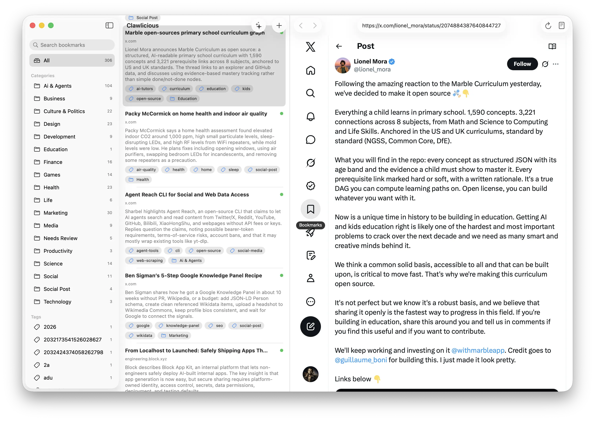

# Clawlicious

Your bookmarks, read and filed by Codex.

Clawlicious saves a page, extracts it as Markdown, and asks Codex for a useful
title, summary, category, and tags. Search the result in a native macOS app or
give the archive to your agent.

> [!WARNING]
> Clawlicious requires macOS 26 and ships from source. It also sends
> up to 12,000 characters of each saved page to OpenAI for summarization.

## Quickstart

```sh
$ git clone https://github.com/mxcl/clawlicious
$ cd clawlicious
$ scripts/build.sh --run
Building for debugging...
Build complete!
```

Paste a URL into the `+` popover, or put your browser in front and press
Command-Control-Option-B. Clawlicious loads the page, files it, and keeps the
original Markdown beside the metadata.

The shortcut supports Safari, Chrome, ChatGPT Atlas, Brave, Edge, Firefox, and
Arc. For other browsers, choose **Bookmark > Copy Browser Bookmarklet** and use
the copied JavaScript as a browser bookmark.

## Let Codex sort it out

Clawlicious reads credentials from `OPENAI_API_KEY` or `~/.codex/auth.json`.
Codex OAuth users should also have the `codex` executable on `PATH`; Clawlicious
uses its app server when the token can't call the Responses API.

```sh
$ open ~/Documents/Clawlicious
```

You get `bookmarks.json`, one Markdown file per bookmark, and prior page
snapshots under `versions/`. Your archive stays useful without Clawlicious.

Click the sparkle button to open a Codex task with access to the local bookmark
API. It can search saved links, add a prepared bookmark, or update metadata.
The API listens on `127.0.0.1:45873` and requires the generated token included
in that task.

> [!NOTE]
> Search inside Clawlicious is local. Summarizing a new page is not.

## Install it

You need the Swift 6.2 toolchain in addition to macOS 26.

```sh
$ scripts/build.sh --install --run
# ^^ builds an ad-hoc-signed app and copies it to /Applications
```

The menu bar helper adds the browser shortcut and can start at login. macOS will
ask for Automation permission the first time it reads a browser's current URL.

For the build script's remaining options:

```sh
$ scripts/build.sh --help
usage: scripts/build.sh [--install] [--run]
```

## Contributing

```sh
$ swift test
Executed 33 tests, with 0 failures
```

Build the app with `scripts/build.sh --run`. Clawlicious is a Swift Package, so
there's no Xcode project to regenerate or cajole.
